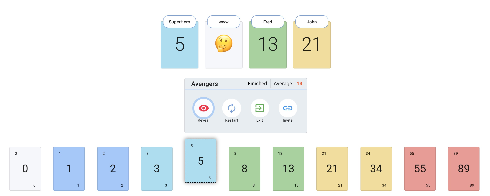

<h1 align="center">Planning Poker App</h1>

Free / Open source Scrum/Agile Planning Poker Web App to estimate user stories for the Agile/Scrum teams. Create session and invite team members to estimate user stories efficiently. Intuitive UI/UX for voting the story points, showing team members voting status with emojis(👍 - Voting Done, 🤔 - Yet to Vote). Session Moderator has full control on revealing story points and restarting the session.

> [!TIP]
> So, Adam Manuel here. I forked this repository that was already workeing, but I don't like GCP or firebase, so I replaced firebase with FaunaDB. I'm going to keep adding some additional automation as I felt the first time I used this with a group resulted in too much manual data input. Feel free to use any of this code, however you want.


Here's an example of the add'l features shown in the video below
 - Added markdown rendering using the markdowns folder
 - Added a secondary screen, with movable game center component
 - Saves the votes for the session in localstorage
 - Button to save the localstorage as a JSON for easy access to the data gathered
 - Automatic screen switching during the vote reveal, and again for the next topic

https://github.com/user-attachments/assets/c5be5b8f-5621-490a-bd53-8d50b5271f57


## Home Page


## Active Session



## Features

1. Create new Session(Fibonacci or TShirt size)
2. Join Session
3. Invite Link
4. Session controller - Moderator can Reveal and restart the session anytime.
5. Reveal - Reveal the cards for all users
6. Voting status - Users Cards show voting status using emojis - 👍 - Voting Done, 🤔 - Yet to Vote
7. Remove user from session
8. Delete Session - Moderator can delete the session completely.

## Tech Stack

1. React - Frontend
2. Material-ui - UI Components
3. FaunaDB - Database
4. RemarkJS

## How to run the app locally for development

1. Clone the repo

    ```bash
    git clone https://github.com/AdamManuel-dev/planning-poker.git
    ```

2. Run `yarn` command to install the required npm package.
3. Run `yarn start` to start the app.
4. Access the app at `http://localhost:3000`.
5. We use the same production database for local development too, so avoid creating too many new sessions and re-use existing one.

## Development Guidelines

1. Keep it simple as much as possible
2. Add required unit tests
3. Use strong type always
4. Use functional and hooks based approach for components
5. Avoid adding new colors
6. Use css until we have scss in place
7. Don't duplicate code and use service folder to keep non-component/shared codes

## Pending features

1. Add timer
2. Preserve history of voting and show it in session
3. Automatically aggregate all values at the end, and save a CSV of each vote
4. Have ChatGPT contininously generate user stories if confused about the epic
5. Create a text field that lets you past in a Notion database URL, and it turns it into individual slides planning poker. 
